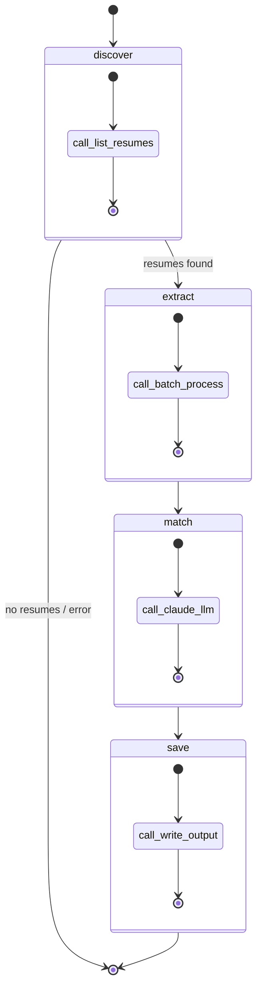
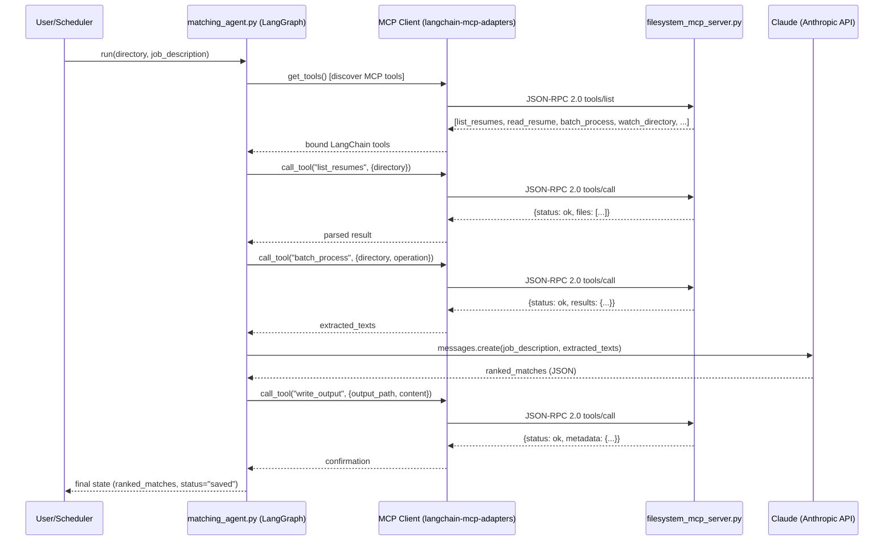
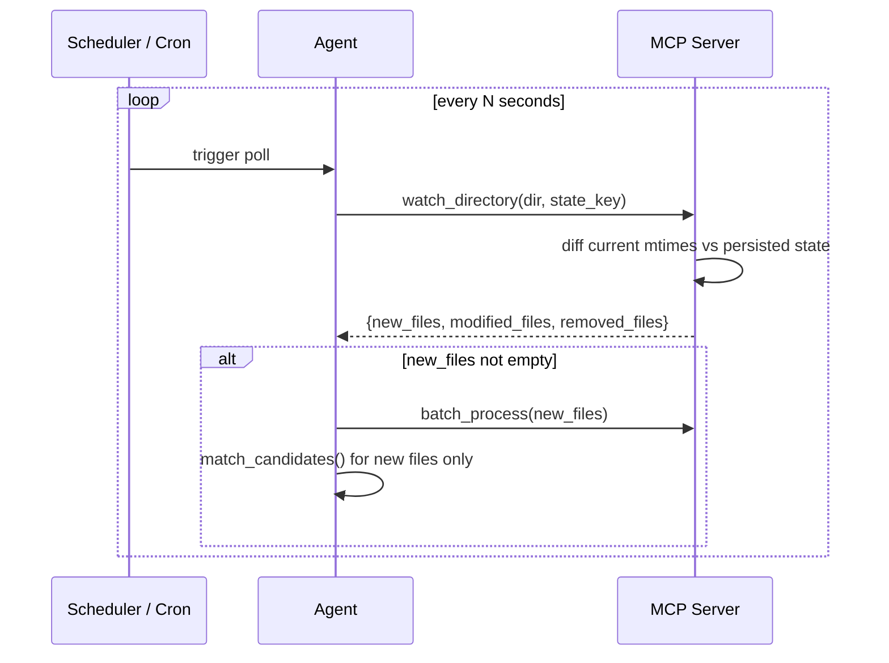

# Agent ↔ MCP Workflow Diagrams

## 1. Agent state machine (LangGraph)

```mermaid
stateDiagram-v2
    [*] --> discover
    discover --> extract: resumes found
    discover --> [*]: no resumes / error
    extract --> match
    match --> save
    save --> [*]

    state discover {
        [*] --> call_list_resumes
        call_list_resumes --> [*]
    }
    state extract {
        [*] --> call_batch_process
        call_batch_process --> [*]
    }
    state match {
        [*] --> call_claude_llm
        call_claude_llm --> [*]
    }
    state save {
        [*] --> call_write_output
        call_write_output --> [*]
    }
```

## 2. Sequence: agent, MCP client, MCP server, LLM

```mermaid
sequenceDiagram
    participant U as User/Scheduler
    participant A as matching_agent.py (LangGraph)
    participant C as MCP Client (langchain-mcp-adapters)
    participant S as filesystem_mcp_server.py
    participant L as Claude (Anthropic API)

    U->>A: run(directory, job_description)
    A->>C: get_tools() [discover MCP tools]
    C->>S: JSON-RPC 2.0 tools/list
    S-->>C: [list_resumes, read_resume, batch_process, watch_directory, ...]
    C-->>A: bound LangChain tools

    A->>C: call_tool("list_resumes", {directory})
    C->>S: JSON-RPC 2.0 tools/call
    S-->>C: {status: ok, files: [...]}
    C-->>A: parsed result

    A->>C: call_tool("batch_process", {directory, operation})
    C->>S: JSON-RPC 2.0 tools/call
    S-->>C: {status: ok, results: {...}}
    C-->>A: extracted_texts

    A->>L: messages.create(job_description, extracted_texts)
    L-->>A: ranked_matches (JSON)

    A->>C: call_tool("write_output", {output_path, content})
    C->>S: JSON-RPC 2.0 tools/call
    S-->>C: {status: ok, metadata: {...}}
    C-->>A: confirmation
    A-->>U: final state (ranked_matches, status="saved")
```

## 3. watch_directory polling loop (new capability)

```mermaid
sequenceDiagram
    participant Sched as Scheduler / Cron
    participant A as Agent
    participant S as MCP Server

    loop every N seconds
        Sched->>A: trigger poll
        A->>S: watch_directory(dir, state_key)
        S->>S: diff current mtimes vs persisted state
        S-->>A: {new_files, modified_files, removed_files}
        alt new_files not empty
            A->>S: batch_process(new_files)
            A->>A: match_candidates() for new files only
        end
    end
```
